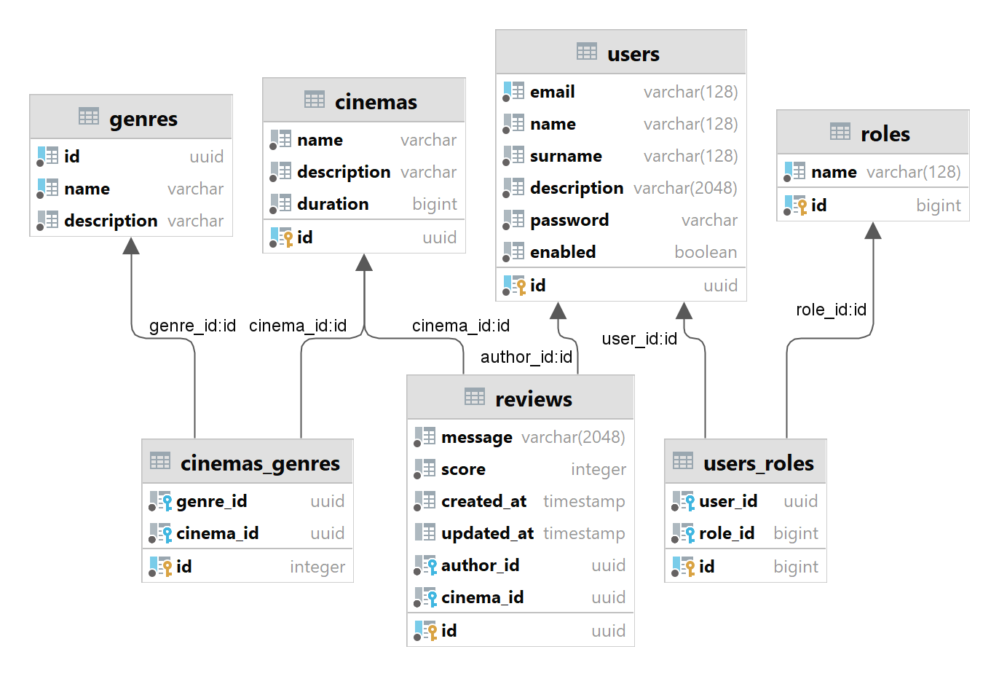

# _⚠️ Данный проект перенесён на [gitlab](https://gitlab.com/SvytDola/cinema/)._

## Rest приложение подборки кино.
***Цель проекта:*** Реализовать полноценный сервис по поиску фильмов, возможность их оценивать и комментировать.

# Оглавление
* [Список задач](#tasks)
* [Конфигурация](#configuration) 
* [Сборка и запуск](#build) 
* [ER Диаграмма](#diagram)


## Список задач: <a id=tasks>
- [x] CRUD 💢
  - [x] Рецензий критиков на кино.
  - [x] Критики.
  - [x] Жанры кино.
  - [x] Кино.
- [ ] Функции 🛠️
  - [x] Получние кино по жанрам (учесть, что их может быть несколько).
  - [x] Получение рецензий критиков по кино.
  - [x] JWT авторизация.
  - [ ] I18N (Было бы неплохо добавить его поддержку в swagger).
  - [x] Swagger.


***NOTE:*** _Отдельная благодарность этому [человеку](https://github.com/DavidRezcov) за помощь._

## Конфигурация <a id=configuration>
Базовая настройка проекта включает в себя добавления файла `env.properties` в корень проекта.
```properties
DB_URL=jdbc:postgresql://postgres:5432/cinema
DB_USERNAME=postgres
DB_PASSWORD=postgres

# Приватный ключ для jwt авторизации.
JWT_KEY=3677397A24432646294A404E635266556A586E5A7234753778214125442A472D
```

## Сборка и запуск проекта <a id=build>


Для начала клонируем проект.

```console
git clone https://github.com/SvytDola/cinema-spring.git
```

После необходимо его собрать.

```console
mvn clean compile package
```

Затем поднять приложение.
```console
docker-compose up
```

***NOTE:*** _На этом у меня пока всё, всем спасибо._

## Диаграмма <a id=diagram>


